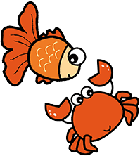

<div align="center">



<h1>Koifish</h1>
<h3>A toolchain for community collaboration</h3>


[](https://gitpod.io/#https://github.com/trisasnava/koifish)
[](https://crates.io/crates/koifish)
[](https://github.com/trisasnava/koifish/releases)

[](https://github.com/trisasnava/koifish/actions?query=workflow:cargo-test)
[](https://github.com/trisasnava/koifish/actions?query=workflow:mdbook-deploy)

</div>

-----------------------------------------------------------------------------------------------

## What is Koifish

A toolchain for community collaboration.

## Community

<a href="https://trisasnava.slack.com/join/shared_invite/enQtODg1NjI0NTc1NzAzLTBjYTM1YjQxZWZkMTExYTBlNTcxNjQzYTc0MjRmNDNjMmIxZmMwZjM5ODFkZWExNjJkNWMwZWRjOGJlODdiM2Q"></a>
<a href="https://discord.gg/JeqN3Q9E"></a>

## Installation


### Cargo

```shell
cargo install koifish
```

### Binary

Download from [release](https://github.com/trisasnava/koifish/releases/latest) and to `PATH`

## How to use

```shell script
> koi -h

    █▄▀ █▀█ ░ █▀▀ ░ █▀ █░█
    █░█ █▄█ █ █▀▀ █ ▄█ █▀█   0.0.5

USAGE:
    koi <SUBCOMMAND>

FLAGS:
    -h, --help       Prints help information
    -V, --version    Prints version information

SUBCOMMANDS:
    help       Prints this message or the help of the given subcommand(s)
    join       join our SLACK channel
    login      verify login via GitHub Oauth
    MEET       start a meeting with https://MEET.jit.si/koi
    open       open koifish GITHUB|WEBSITE|DOCS
    upgrade    upgrade tool for Koifish
```

## Contributing

- [Code of conduct](DOCS/src/contribution/CODE_OF_CONDUCT.md)

- [Sign the CLA](DOCS/src/contribution/CLA.md)

- [Contribute code](DOCS/src/contribution/code.md)

- [Contribute DOCS](DOCS/src/contribution/DOCS.md)

- [FAQ](DOCS/src/FAQ.md)

[](https://gitpod.io/#https://GITHUB.com/trisasnava/koifish)

## LICENSE

[Apache 2.0](LICENSE)